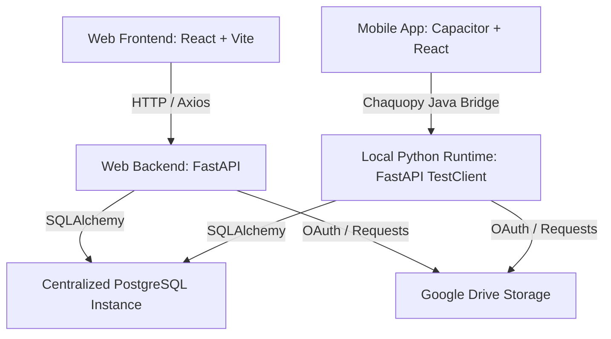

# Question Mind 🧠 — AI-Powered Question Bank Generator

Question Mind is an advanced, academic-focused Question Bank generation platform. It automatically parses course Syllabus and CDAP (Course Delivery Action Plan) documents to generate structurally verified, high-quality question papers and answer keys mapped directly to Bloom's Taxonomy Levels (BTL1–BTL6).

---

## 🏗️ Project Architecture & Components

The system is structured as a decoupled web application with a shared PostgreSQL database, and includes a mobile app wrapper:



### 1. Web Version
* **Frontend (`/frontend`)**: Built with React 18, TypeScript, TailwindCSS, and Zustand. Exposes responsive dashboard layouts, course configurations, pattern blueprints, and question bank viewers.
* **Backend (`/backend-python`)**: Powered by FastAPI, SQLAlchemy (PostgreSQL), and Uvicorn. Exposes REST endpoints for authentication, subject configuration, document parsing, and AI question generation.

### 2. Mobile App Version (`/mobile-app`)
* **Mirror Frontend**: The React frontend is bundled into a native Android application using **Capacitor**.
* **Offline-Capable Local Backend**: Uses **Chaquopy** to host the Python runtime inside the Android package. Backend routing is handled locally on the device via FastAPI's `TestClient` bridge, preventing server-unreachable errors while communicating directly with the remote database.

### 3. Unified Infrastructure
* **Database**: High-performance PostgreSQL database containing tables for users, subjects, syllabus units, question banks, and staff assignments.
* **Google Drive Storage**: Uploaded files (Syllabi PDFs, CDAP Excel documents, and Question Bank spreadsheets) are securely uploaded directly to Google Drive via service accounts, bypassing local file persistence limitations on ephemeral deployments (like Render or Android packages).

---

## 👥 Roles & Access System

The platform distinguishes three primary roles to balance management with operational independence:

### 1. Admin (System Monitor & Creator)
* **Role**: The Admin controls account creation, subject allocation, and system monitoring.
* **Account Provisioning & Auto-Emailing**: The Admin manually creates HOD and Faculty user accounts. Upon creation, the backend **instantly sends an automated HTML welcome email** containing the username, temporary password, department, and direct system access link via the Brevo transactional email API.
* **Permissions Control**: Admin assigns staff members to specific subjects, configuring flags like `canEditPattern`, `canGenerateQuestions`, and `canApprove`.
* **System Monitoring**: Admin monitors overall activities and staff statuses across departments.

### 2. Head of Department (HOD)
* **Role**: Independent operator.
* **Operations**: HODs function independently without depending on Admin intervention or staff hierarchy. They manage their assigned subjects, upload syllabi, configure question patterns, and generate/approve question banks freely.

### 3. Faculty
* **Role**: Independent operator.
* **Operations**: Faculty members have equal independence for their assigned subjects. They can configure course plans, create blueprint patterns, generate question banks, and export answers without hierarchical bottlenecks.

> [!NOTE]  
> HOD and Faculty are independent user profiles. They run their workflows separately. The Admin role exists to configure their initial access rights, assign subjects, and monitor overall utilization.

### 🔒 Per-User Data Isolation

Every login is fully sandboxed to the content it created. Subjects, syllabi, CDAPs, question patterns, and generated question banks are scoped server-side to their owner (`created_by` / `generated_by`):

* A user only ever **sees, edits, downloads, shares, or deletes their own** records — list endpoints filter by owner and every detail/mutation endpoint enforces an ownership check (returning `404` to non-owners so existence is never leaked).
* One user's data can never appear in or interfere with another user's workspace, even though they share a single database.

---

## 📧 Emailing & Communications

The emailing system is highly critical for onboarding and sharing. All transactional emails are styled with custom HTML layouts:

1. **User Welcome Email (`send_user_welcome_email`)**: Triggered immediately when the Admin creates a user. Delivers secure credentials and login pointers.
2. **Question Bank Sharing (`send_share_notification`)**: Allows sharing generated question banks and answer keys directly to other staff members' emails, automatically attaching the formatted Excel spreadsheet dynamically.
3. **Password Resets & Updates**: Sends immediate alerts and new credentials on request.

### Delivery via Brevo (HTTP API)

Production deployments (e.g. Render) **block outbound SMTP ports** (587/2525), so email is delivered through **Brevo's HTTP REST API** (`https://api.brevo.com/v3/smtp/email`) rather than SMTP.

> [!IMPORTANT]
> The REST API authenticates with the Brevo **API key** (`BREVO_API_KEY`, starts with `xkeysib-`), which is a **different credential** from the SMTP key (`SMTP_PASS`, starts with `xsmtpsib-`). The API key is found under **Brevo → SMTP & API → API Keys**.

Required environment variables for production email:

| Variable | Example | Purpose |
|----------|---------|---------|
| `EMAIL_PROVIDER` | `brevo` | Selects the Brevo HTTP API path (`local` uses dev SMTP) |
| `BREVO_API_KEY` | `xkeysib-...` | REST API key — **required on Render** |
| `FROM_EMAIL` | `you@domain.com` | Must be a **verified sender** in Brevo |
| `FROM_NAME` | `Question Mind` | Display name on outgoing mail |

`SMTP_HOST` / `SMTP_USER` / `SMTP_PASS` remain only as a local SMTP fallback and are not used on Render.

---

## 🎯 Bloom's Taxonomy (BTL) & AI Generation

Rather than applying post-generation metadata tagging (which leads to mismatches between a question's content and its label), Question Mind employs a **Slot-Based Pre-Allocation Strategy**:

1. **Blueprint Slots**: The user configures a target BTL distribution (e.g. 3 x BTL2, 2 x BTL3, 1 x BTL6). The backend maps these to a list of exact question slots.
2. **Prompt Verb Injection**: Each slot dynamically requests Bloom's Taxonomy cognitive action verbs matching that level (e.g., *explain/describe* for BTL2; *calculate/apply* for BTL3; *design/formulate* for BTL6).
3. **Pre-Stamping**: Parsed questions are automatically aligned with slot parameters by index inside `_finalise`, ensuring 100% taxonomy-content alignment.
4. **LLM Provider Fallback Chain**: Generation operates with an automatic fallback chain to ensure maximum uptime:
   ```
   Groq (Llama-3.3-70b) ──> Cerebras (gpt-oss-120b) ──> NVIDIA NIM ──> Gemini 2.5 Flash
   ```

---

## 🧹 Cleaned-Up Features
To maximize server-side security and streamline the code, we removed the client-side API key and preference stores:
* **Files Deleted**: `ApiKeyInput.tsx`, `ProviderSelector.tsx`, `aiSettingsApi.ts`, `settingsStore.ts`, and `ai_settings.py`.
* **Rationale**: Custom client-supplied keys are bypassed in favor of centrally managed, secure environment keys loaded on the backend (Groq, Cerebras, NVIDIA, Gemini, OpenRouter), preventing potential key exposure and ensuring consistent configuration.

To further enforce security and adhere to the strict Admin-provisioning model, open registration features were entirely removed:
* **Files Deleted**: `Register.tsx`
* **Code Cleaned**: Removed open `/register` routes from the frontend router (`App.tsx`) and client API layers (`api.ts`).
* **Rationale**: The system dictates that only the Admin creates new accounts. Removing self-registration endpoints prevents unauthorized account creation and guarantees the integrity of the role-based system.

---

## 🚀 Getting Started

### 1. Prerequisites
* Python 3.11+
* Node.js 18+
* PostgreSQL instance
* Google Drive Service Account credentials (.json file)

### 2. Running Web Backend
```bash
cd backend-python
python -m venv venv
source venv/bin/activate  # On Windows: venv\Scripts\activate
pip install -r requirements.txt
uvicorn app.main:app --host 127.0.0.1 --port 8000 --reload
```

### 3. Running Web Frontend
```bash
cd frontend
npm install
npm run dev
```

---

## 📄 License
MIT © 2026 Krish Academia
